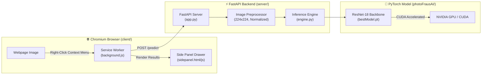

# 🛡️ PhotoFraus AI

> **Real-time AI Image Detection, Forensic Provenance Inspector & Browser Extension**

PhotoFraus AI is an end-to-end computer vision platform designed to detect AI-generated imagery (Midjourney, Stable Diffusion, DALL-E, Flux, etc.) and distinguish synthetic content from authentic human-captured photography.

The project features a **PyTorch deep learning model (99.31% validation accuracy)**, a high-throughput **FastAPI inference server with CUDA GPU acceleration**, and a **Chromium Browser Extension (Manifest V3)** with side-panel diagnostics and live on-page image inspection.

---

## 📑 Table of Contents

- [Overview](#-overview)
- [Key Features](#-key-features)
- [System Architecture](#-system-architecture)
- [Project Structure](#-project-structure)
- [Installation & Setup](#-installation--setup)
- [Running the System](#-running-the-system)
  - [1. Start the Inference Server](#1-start-the-inference-server)
  - [2. Load the Chrome Extension](#2-load-the-chrome-extension)
  - [3. CLI Testing & Verification](#3-cli-testing--verification)
- [API Reference](#-api-reference)
- [Model Details](#-model-details)
- [Technology Stack](#-technology-stack)
- [License](#-license)

---

## 🌟 Overview

With the rapid proliferation of hyper-realistic generative diffusion models, distinguishing genuine media from synthetic fakes is increasingly critical. PhotoFraus AI bridges deep learning forensics and everyday browsing by providing instant, in-browser classification directly from webpage context menus and side-panel drawers.

---

## ⚡ Key Features

- **🚀 99.31% Detection Accuracy**: Fine-tuned ResNet-18 vision backbone trained on high-diversity binary datasets.
- **⚡ Fast GPU Inference**: Sub-50ms inference latency using PyTorch with TensorFloat-32 (TF32) and CUDA optimization.
- **🌐 Chromium Browser Extension (Manifest V3)**:
  - **Context Menu Inspection**: Right-click any image on the web to inspect authenticity.
  - **Interactive Side Panel**: Full breakdown showing AI vs. Real probabilities, latency, and status badges.
  - **Zero DOM Pollution**: On-page visual indicators live in isolated Shadow DOM elements to prevent target website style collisions.
- **🛡️ Resilient Image Pipeline**: Handles remote image URLs, data URIs (`base64`), and anti-hotlinking headers (spoofed User-Agent/Referer).
- **💻 Standalone CLI**: Quickly test local image files from the terminal with `python test_inference.py <image_path>`.

---

## 🏗️ System Architecture



---

## 📂 Project Structure

```text
Photofraus AI/
├── client/                     # Chrome Extension (Manifest V3)
│   ├── manifest.json           # Extension permissions, side panel & content script config
│   ├── background.js           # Background service worker (context menus, API proxy)
│   ├── content.js              # In-page DOM inspector & shadow-DOM badges
│   ├── sidepanel/              # Side-panel drawer interface
│   │   ├── sidepanel.html      # Analysis drawer UI layout
│   │   ├── sidepanel.css       # Dark theme styles & confidence gauges
│   │   └── sidepanel.js        # State management, health pings & UI rendering
│   ├── styles/
│   │   └── content.css         # Shadow DOM isolation styling
│   └── assets/                 # Extension icons (16x16, 48x48, 128x128)
│
├── server/                     # FastAPI Inference Server
│   ├── app.py                  # API routes (POST /predict, GET /health)
│   ├── requirements.txt        # Server dependencies
│   └── core/
│       ├── config.py           # Host, port, threshold & checkpoint paths
│       ├── engine.py           # InferenceEngine: PyTorch model forward pass
│       └── preprocessor.py     # Image downloading, decoding & normalization
│
├── photoFrausAI/               # Deep Learning Model & Training Pipeline
│   ├── model.py                # ResNet-18 / EfficientNet-B0 architecture definition
│   ├── dataset.py              # PyTorch Dataset wrapper with GPU transforms
│   ├── train.py                # GPU-accelerated training pipeline
│   ├── test_inference.py       # Standalone testing script
│   ├── bestModel.pt            # Trained checkpoint weights (99.31% Val Acc)
│   └── checkpoint/             # Epoch checkpoint backups
│
├── test_inference.py           # Root CLI shortcut for quick image testing
└── README.md                   # Project documentation
```

---

## 📦 Installation & Setup

### Prerequisites

- **Operating System**: Windows, Linux, or macOS
- **Python**: 3.10+ (Recommended: Python with NVIDIA CUDA support)
- **Browser**: Google Chrome, Microsoft Edge, Brave, or any Chromium-based browser
- **NVIDIA GPU** *(optional, but recommended for <30ms latency; falls back to CPU automatically)*

### 1. Clone & Navigate

```bash
cd "Photofraus AI"
```

### 2. Install Server Dependencies

```bash
pip install -r server/requirements.txt
```

*(Ensure PyTorch with CUDA is installed if you want GPU acceleration. See [pytorch.org](https://pytorch.org/get-started/locally/) for your CUDA version).*

---

## 🚀 Running the System

### 1. Start the Inference Server

From the project root:

```bash
cd server
python app.py
```

Or using Uvicorn directly:

```bash
uvicorn server.app:app --host 127.0.0.1 --port 8000 --reload
```

The server will initialize on `http://127.0.0.1:8000`:
```text
[*] Loading model on cuda:0 from ...\photoFrausAI\bestModel.pt...
=================================================================
  PhotoFraus AI Engine: PyTorch Model Connected
  Checkpoint File : C:\Users\...\photoFrausAI\bestModel.pt
  Architecture    : resnet18
  Validation Acc  : 99.31%
  Inference Device: cuda:0
=================================================================
[*] Starting PhotoFraus AI Server on http://127.0.0.1:8000
```

### 2. Load the Chrome Extension

1. Open **Google Chrome** (or Edge/Brave).
2. Go to `chrome://extensions` in your address bar.
3. Turn **ON** the **Developer mode** toggle in the top-right corner.
4. Click **Load unpacked** in the top-left corner.
5. Select the **`client`** directory inside this repository.
6. Pin **PhotoFraus AI** to your browser toolbar.

### 3. CLI Testing & Verification

You can test any image locally using the root CLI wrapper without starting the browser extension:

```bash
python test_inference.py "path/to/image.png"
```

Output:
```text
============================================================
PhotoFraus AI - Inference Verification
[*] Compute Device : cuda:0
[*] Model File     : C:\Users\...\photoFrausAI\bestModel.pt
[*] Architecture   : resnet18
[*] Checkpoint     : Epoch 48 (Validation Accuracy: 99.31%)
============================================================
[*] Inspecting target image: path/to/image.png

[RESULT]
>> Prediction   : Real
>> Confidence   : 96.84%
>> Breakdown    : AI: 3.16% | Real: 96.84%
============================================================
Inference test passed successfully!
```

---

## 📡 API Reference

### Health Check

`GET /health`

**Response:**
```json
{
  "status": "ok",
  "device": "cuda:0",
  "model_file": "C:\\...\\photoFrausAI\\bestModel.pt",
  "architecture": "resnet18"
}
```

### Predict Image Authenticity

`POST /predict`

**Request Body:**
```json
{
  "image_url": "https://example.com/sample.jpg"
}
```

**Response:**
```json
{
  "is_ai": false,
  "confidence": 0.035,
  "latency_ms": 28.4,
  "raw": [
    { "label": "AI Generated", "score": 0.035 },
    { "label": "Authentic Real", "score": 0.965 }
  ],
  "metadata": {
    "dimensions": { "width": 1024, "height": 768 },
    "format": "JPEG",
    "hasC2PA": false,
    "software": "Standard Web Media"
  }
}
```

---

## 🧠 Model Details

- **Backbone**: Modified ResNet-18 (timm / torchvision)
- **Input Resolution**: `3 x 224 x 224` normalized via standard ImageNet parameters (`mean=[0.485, 0.456, 0.406]`, `std=[0.229, 0.224, 0.225]`)
- **Classes**:
  - `0`: **AI-Generated Image** (Synthetic)
  - `1`: **Authentic Real Image** (Human-Captured Photography)
- **Decision Boundary**: Configured with a default decision threshold of `0.50` (configurable via `THRESHOLD` environment variable).
- **Validation Accuracy**: `99.31%` achieved at Epoch 48.

---

## 🛠️ Technology Stack

- **Machine Learning**: PyTorch, Torchvision, TIMM, HuggingFace Datasets
- **Backend**: FastAPI, Uvicorn, Pydantic, Pillow (PIL), Requests
- **Frontend / Extension**: JavaScript (ES6+), HTML5, CSS3 (Custom Design System, Glassmorphism, Dark Mode), Chrome Extensions Manifest V3 (Side Panel API, Content Scripts, Service Worker)

---

## 📄 License

This project is licensed under the MIT License.
